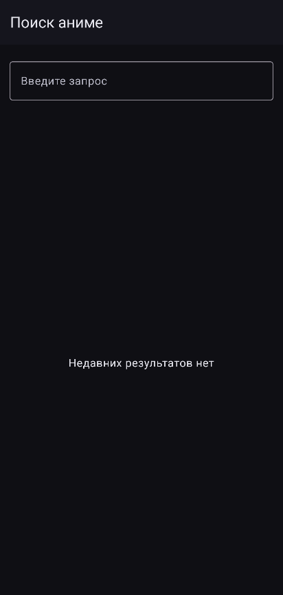
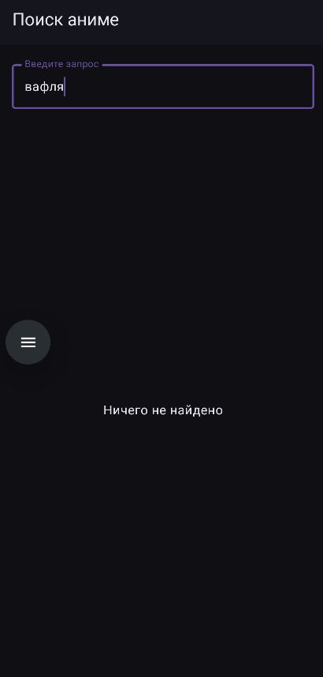
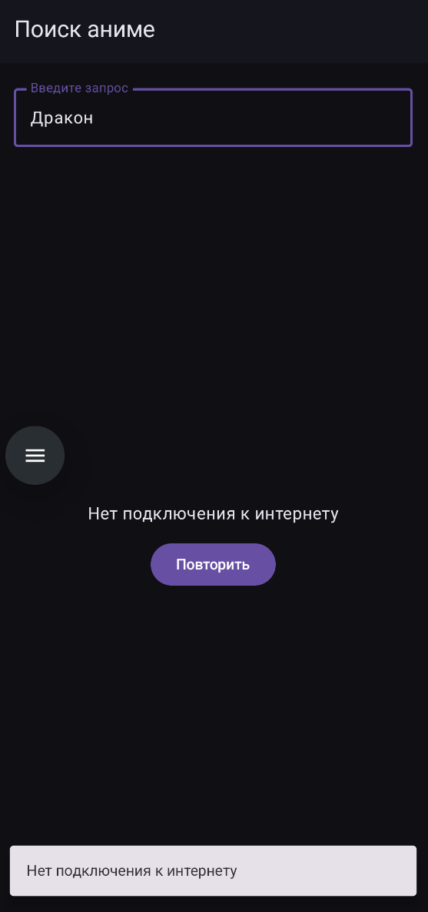
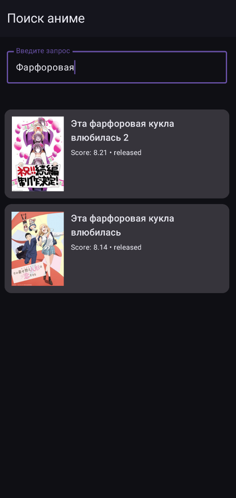
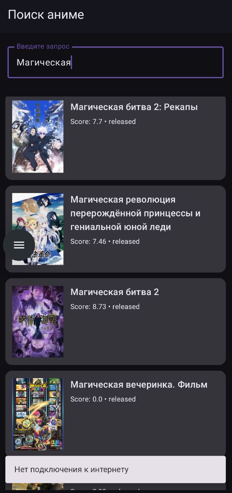
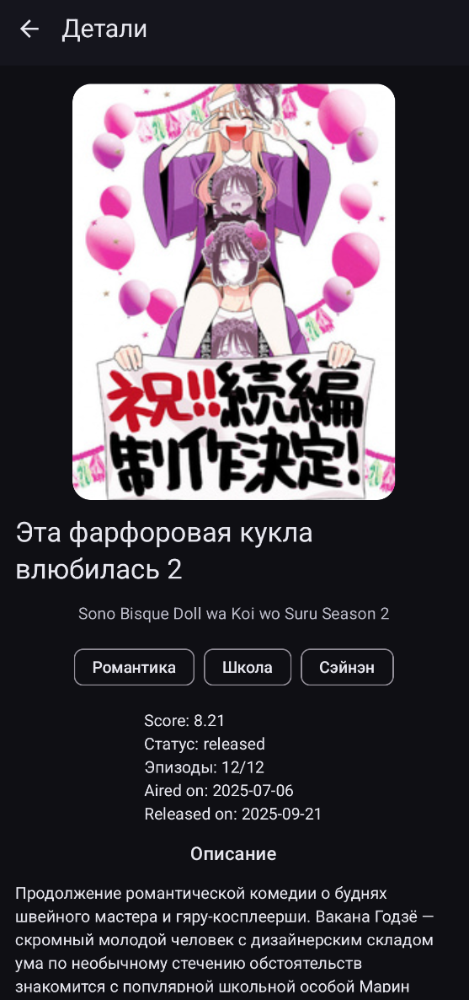

# AnimeSearchApp 〜 セメスター課題  ( •̀ ω •́ )✧

> Android-приложение для поиска аниме и просмотра подробной информации о тайтлах.  
> UI на Jetpack Compose (Material 3), сеть через Retrofit/OkHttp, локальное хранение через Room, DI через Hilt.  (＾▽＾)


---

## 概要 / About  (。・ω・。)
**AnimeSearchApp** — учебный проект (семестровая работа) под Android: поиск аниме, список результатов и экран деталей.  
Приложение получает данные из внешнего REST API, показывает состояния загрузки/ошибки и использует современный стек разработки.

---

## 目的 / Цель работы  (ง •̀_•́)ง
Разработать Android-приложение на Kotlin, которое:
- выполняет сетевые запросы к внешнему API;
- отображает результаты поиска и детальную информацию о выбранном тайтле;
- использует архитектурный подход **MVVM** и **Dependency Injection**;
- хранит данные локально (Room) для повторного отображения.

---

## 機能 / Функционал  ヾ(•ω•`)o
- 🔎 Поиск аниме по названию
- 📋 Список результатов поиска
- 🧾 Экран деталей выбранного аниме (постер, описание, параметры)
- ⏳ Состояния UI: **Loading / Error / Content**
- 🌙 Тёмная тема (Material 3)

---

## 技術 / Стек и библиотеки  (｀・ω・´)
### Инструменты и версии
- Android Gradle Plugin: **8.6.1**
- Kotlin: **2.0.21**
- KSP: **2.0.21-1.0.25**
- Compile SDK: **35**
- Target SDK: **35**
- Min SDK: **24**
- Java/Kotlin toolchain: **17**

### UI
- Jetpack Compose (BOM **2024.10.01**)
- Material 3
- Navigation Compose (**2.8.4**)
- Lifecycle Runtime / ViewModel Compose (**2.8.7**)

### Асинхронность
- Kotlin Coroutines (**1.9.0**)  (ﾉ◕ヮ◕)ﾉ*:･ﾟ✧

### Сеть и сериализация
- Retrofit (**2.11.0**)
- OkHttp (**4.12.0**) + Logging Interceptor
- Kotlinx Serialization JSON (**1.7.3**)
- Retrofit Kotlinx Serialization Converter (**1.0.0**)

### Локальное хранение
- Room (**2.6.1**) + KSP compiler

### DI
- Hilt (**2.52**) + hilt-navigation-compose (**1.2.0**)

### Изображения
- Coil Compose (**2.7.0**)

---

## 設計 / Архитектура (MVVM)  (・∀・)
Подход **MVVM** и разделение ответственности:

- **UI (Compose)** — экраны/компоненты, отображение состояния
- **ViewModel** — хранение `uiState`, обработка событий, загрузка данных
- **Repository/Data** — сеть через Retrofit/OkHttp, локальные операции через Room

Состояние экранов отображается через ветвление:
- `Loading` → индикатор загрузки  
- `Error` → сообщение/экран ошибки  
- `Content` → основной контент  (｀・ω・´)ゞ

### Дерево проекта (структура)
```
AnimeSearchApp/
├── settings.gradle.kts
├── build.gradle.kts
├── gradle.properties
├── gradle/
│   └── libs.versions.toml
└── app/
    ├── build.gradle.kts
    └── src/main/
        ├── AndroidManifest.xml
        └── java/com/example/animesearchapp/
            ├── AnimeSearchApp.kt
            ├── core/
            │   ├── AppConfig.kt
            │   ├── result/
            │   │   ├── AppResult.kt
            │   │   └── NetworkError.kt
            │   └── util/
            │       ├── NetworkMonitor.kt
            │       └── RetrofitCall.kt
            ├── data/
            │   ├── local/
            │   │   ├── AnimeDatabase.kt
            │   │   ├── dao/AnimeDao.kt
            │   │   └── entity/
            │   │       ├── AnimeEntity.kt
            │   │       ├── GenreEntity.kt
            │   │       ├── SearchQueryEntity.kt
            │   │       ├── AnimeGenreCrossRef.kt
            │   │       ├── QueryAnimeCrossRef.kt
            │   │       └── relations/
            │   │           ├── AnimeWithGenres.kt
            │   │           └── QueryWithAnimes.kt
            │   ├── mapper/
            │   │   ├── AnimeMappers.kt
            │   │   └── GenreMappers.kt
            │   ├── remote/
            │   │   ├── ShikimoriApi.kt
            │   │   └── dto/
            │   │       ├── AnimeDetailsDto.kt
            │   │       ├── AnimeSearchDto.kt
            │   │       ├── GenreDto.kt
            │   │       └── ImageDto.kt
            │   └── repository/
            │       └── AnimeRepositoryImpl.kt
            ├── di/
            │   ├── DatabaseModule.kt
            │   ├── NetworkModule.kt
            │   └── RepositoryModule.kt
            ├── domain/
            │   ├── model/
            │   │   ├── Anime.kt
            │   │   └── Genre.kt
            │   └── repository/
            │       └── AnimeRepository.kt
            └── presentation/
                ├── MainActivity.kt
                ├── navigation/
                │   ├── AppNavGraph.kt
                │   └── Destinations.kt
                ├── ui/
                │   ├── components/
                │   │   ├── AnimeCard.kt
                │   │   ├── EmptyContent.kt
                │   │   ├── ErrorContent.kt
                │   │   ├── GenreChipsRow.kt
                │   │   └── LoadingContent.kt
                │   ├── details/
                │   │   ├── DetailsScreen.kt
                │   │   └── DetailsViewModel.kt
                │   ├── search/
                │   │   ├── SearchScreen.kt
                │   │   └── SearchViewModel.kt
                │   └── theme/
                │       ├── Color.kt
                │       ├── Theme.kt
                │       └── Type.kt
                └── util/
                    └── UiText.kt
```

---

## API / データソース  (。-`ω´-)
Источник данных:
- Shikimori API: https://shikimori.one/api/doc  
- Сайт: https://shikimori.one/

---

## デモ / Демонстрация (скриншоты)  (≧▽≦)
Скриншоты лежат в: `Screenshots/`

**1. Стартовый экран / Пустое состояние (онлайн/офлайн)**





**2. Результаты поиска (список) онлайн/офлайн**




**3. Экран деталей**



---

## 起動方法 / Запуск  ( •̀ ω •́ )✧

### Требования
- Android Studio (актуальная стабильная версия)
- Android SDK
- Устройство/эмулятор Android (SDK **24+**)

### Шаги
1. Клонировать репозиторий:
   - `git clone <URL_репозитория>`
2. Открыть проект в Android Studio
3. Выполнить **Gradle Sync**
4. Нажать **Run** и выбрать устройство  ٩(ˊᗜˋ*)و

---

## APK / Сборка  (｀・ω・´)b
Android Studio:
- `Build > Build Bundle(s) / APK(s) > Build APK(s)`

---
